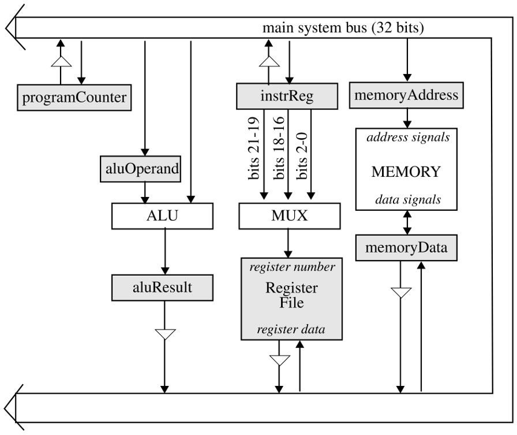
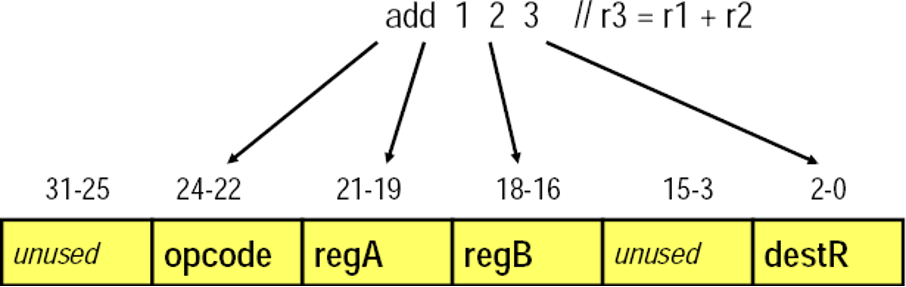
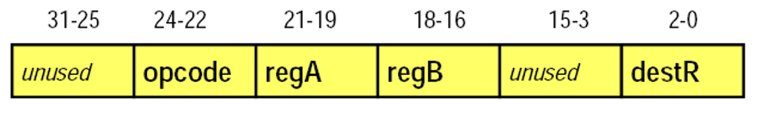



<div style="text-align: center;">

  <p style="text-align: center;">МІНІСТЕРСТВО ОСВІТИ І НАУКИ УКРАЇНИ</p>
  <p style="text-align: center;">НАЦІОНАЛЬНИЙ УНІВЕРСИТЕТ “ЛЬВІВСЬКА ПОЛІТЕХНІКА”</p>

  

  <p style="text-align: center;">КАФЕДРА ЕЛЕКТРОННИХ ОБЧИСЛЮВАЛЬНИХ МАШИН</p>

  <h1 style="margin-bottom: 0; text-align: center;">МЕТОДИЧНІ ВКАЗІВКИ</h1>

  <p style="text-align: center;"><strong>до курсової роботи на тему</strong></p>

  <h2 style="margin-top: 0; text-align: center;">ПРОЄКТУВАННЯ КОМП'ЮТЕРА</h2>

  <p style="text-align: center;">з дисципліни</p>
  <h3 style="text-align: center;"><em>“Архітектура комп’ютерів”</em></h3>

  <p style="text-align: center;"><strong>для студентів спеціальності F7 “Комп’ютерна інженерія”</strong></p>

  <br><br>
  <p style="text-align: center;">Львів 2025</p>

</div>


<div style="page-break-before: always;"></div>

## ЗМІСТ

### - [Вступ](#вступ)
### - [Архітектурні принципи](#архітектурні-принципи)
### - [Система команд](#система-команд)
### - [Способи адресації](#способи-адресації)
### - [Система машинних інструкцій СК](#система-машинних-інструкцій-ск)
### - [Асемблерна мова та асемблер](#асемблерна-мова-та-асемблер)
### - [Поведінкова симуляція](#поведінкова-симуляція)
### - [Асемблерне множення](#асемблерне-множення)
### - [Вихідні дані на проєктування](#вихідні-дані-на-проєктування)
### - [Вимоги щодо оформлення матеріалів проекту](#вимоги-щодо-оформлення-матеріалів-проекту)
### - [Література](#література)
### - [Додатки](#додатки)


<div style="page-break-before: always;"></div>

# Вступ

Вступ містить короткі теоретичні відомості, архітектурний опис комп’ютера, архітектура якого досліджується.

Мета курсового проектування полягає в опануванні студентом знань про принципи дії та архітектуру прототипних варіантів CISC – ком’ютера. Крім того курсовий проект допоможе зрозуміти інструкції простої асемблерної мови та як транслювати програми в машинну мову.

Проект складається з трьох частин. В першій частині розробляється програма, яка перетворює вхідну асемблерну програму у відповідний код на мові машинних інструкцій. В другій частини розробляється поведінковий стимулятор результуючого машинного коду. В третій частині розробляється невеличка програма на асемблер ній мові.

## Архітектурні принципи

В ході виконання даного курсового проекту студент має ознайомитись та опанувати архітектуру CISC – комп’ютера. Приведемо основні принципи даної архітектури, які запропонував Джон фон Нейман:

📌 **Принципи архітектури:**

1. 💾 Інформація кодується в двійковому представленні;
2. 📊 Інформація в комп’ютері ділиться на команди і дані;
3. 🔍 Різнотипні за змістом слова розрізняються за способом застосування, а не по способу кодування;
4. 🧮 Слова інформації розміщаються в комірках пам’яті та ідентифікуються номерами комірок – адресами слів;
5. 📏 Пам’ять є лінійною;
6. 📬 Пам’ять має довільну адресацію;
7. 🧠 Команди і дані зберігаються в одній пам’яті;
8. 🧾 Алгоритми представляються у вигляді послідовності керуючих слів, як називаються командами. Команда визначається найменуванням операції та слів інформації, які в ній приймають участь. Алгоритм записаний у вигляді послідовності команд, називається програмою;
9. 🛠️ Весь набір виконуваних комп’ютером команд називається системою команд комп’ютера;
10. ⏱️ Виконання обчислень, які визначені алгоритмом, являють собою послідовне виконання команд в порядку визначеному програмою.

📌 **Для виконання задачі необхідно:**

1. 📥  забезпечити вибірку команди програми із його пам’яті в заданій послідовності, організувати звернення до неї за відповідними адресами;
2. 🧭 Розпізнати тип виконуваної операції;
3. 📦 Організувати звернення до пам’яті за відповідними адресами для вибірки необхідних для виконання кожної команди даних;
4. ⚙️ Організувати виконання над даними операцій відповідно до вказівок команд;
5. 💽 Зберегти результати обчислень.

Комп'ютер виконує кожну команду як послідовність простих операцій.

📌 **Етапи виконання кожної команди:**

1. 📥 Вибірка команди із пам’яті;
2. 🔎 Визначення типу вибраної команди, тобто її дешифрування;
3. 🗂️ Визначення адрес потрібних даних;
4. 📤 Виконання операцій пересилання даних (зчитування даних із пам'яті в регістри процесора);
5. ⚙️ Виконання операції відповідно до її коду в полі коду операції команди;
6. 🧾 Визначення адрес для запису результату;
7. 💾 Запис результату;
8. 🔁 Підготовка до наступної команди;

📌 **Особливості CISC-процесора:**

1. ⏳ виконання команди за багато тактів, оскільки для цього потрібно здійснити багаторазові операції звернення до основної пам'яті та до програмно-доступних регістрів процесора;
2. 🧮 орієнтація АЛП на виконання великої кількості операцій, що пов'язано з розширеним складом системи команд;
3. 🔍 складна система розпізнавання команди, що пов'язано з великою кількістю методів адресації та великою кількістю форматів команд різної розрядності;
4. 🧑‍💻 Програмне дешифрування для економії апаратури;
5. 🔀 складна організація конвеєризації виконання команд, що пов'язано, в першу чергу, з різнотипністю їх виконання;
6. 🗃️ орієнтація структури на виконання команд типу регістр-пам'ять та пам'ять-пам'ять.

📌 **Основні елементи процесора:**

* 🧠 Арифметико-логічний пристрій (АЛП)
* 🧩 Пристрій керування
* 📂 Регістрова пам’ять (надоперативний ЗП)

📦 До регістрової пам’яті належать:

* 📌 Програмний лічильник (ПЛ)
* 🏷️ Регістр адреси (РгА)
* 🧾 Регістр команд (РгК)
* 📊 Регістр даних (РгД)
* 🧠 Регістр слова стану програми (ССП)
* 📁 Регістровий файл (загальні регістри)

📘 **Пояснення призначення:**

* 📬 РгА — зберігає адресу даних або команди.
* 🧾 РгК — зберігає команду після її зчитування.
* 📊 РгД — зберігає операнд.
* 📌 ПЛ — підраховує команди та зберігає адресу поточної.

Більшість комп'ютерів мають в складі процесора тригери для зберігання бітів стану процесора, або, як їх іще називають, прапорців. Кожен прапорець має спеціальне призначення. Частина прапорців вказує на результати арифметичних і логічних операцій:

📌 **Прапорці (тригери стану):**

* ✅ P — додатній результат
* ❌ N — від’ємний результат
* 0️⃣ Z — нульовий результат
* ➕ C — перенос
* ⚠️ V — переповнення

🔐 Також є прапорці для режимів захисту пам’яті, пріоритетів задач, умовних переходів тощо. Разом вони формують ССП — слово стану програми. 


📁 **Регістровий файл** (РЗП) складається з регістрів загального призначення. Вони використовуються для:

* зберігання даних і проміжних результатів,
* адресної арифметики,
* передачі аргументів та результатів між командами.

---

> 🧩 **Підсумок:** CISC-процесори забезпечують гнучке та потужне середовище виконання завдяки багатій системі команд та глибокій організації процесів обробки. Ці архітектурні принципи формують фундамент сучасних комп’ютерних систем.


## Система команд

📌 **Поняття:**
Різноманітність типів даних, форм представлення та опрацювання, необхідні дії для обробки та керування ходом виконання обчислень призводить до необхідності використання різноманітних команд – набора команд.

🖥️ Кожен процесор має власний набір команд, який називається системою команд процесора.

📚 **Система команд характеризується трьома аспектами:**

1. 📐 формат,
2. 🗂️ способи адресації,
3. ⚙️ система операцій.

### 📐 Формат команди

Формат включає: довжину команди, кількість, розмір, положення, призначення та спосіб кодування полів. Команди містять такі поля:

1. 🧾 тип операції (КОП)
2. 📥 місце першого операнду (А1)
3. 📥 місце другого операнду (А2)
4. 💾 місце запису результату (А3)

🔣 Кожному полю відповідає частина двійкового слова.
Реальна система команд має команди різних форматів, тип яких визначається КОП.

### 💻 Структура команди

Команда зберігається у двійковій формі та складається з:

* 🔢 коду операції (КОП),
* 📍 адресної частини (адреси операндів та результату).

📏 КОП займає **k** розрядів, що дозволяє закодувати до **2<sup>k</sup>** операцій.
Якщо процесор підтримує **Nc** операцій, мінімальне **k** визначається як `k = [log Nc]` (округлення вгору).

Адресна частина займає **m** розрядів.
Кожна адреса — **mi** біт, де **і = 1, 2, ..., l** (l — кількість адресних полів).

📏 Повна довжина команди: `k + m` — повинна відповідати розміру даних або бути кратною йому (наприклад: 8, 16, 32 біти).

### ✍️ Форми представлення команд

Окрім двійкової, використовуються:

* 🧮 вісімкова (3 біти = 1 цифра)
* 🔢 шістнадцяткова (4 біти = 1 цифра)
* 📝 мнемонічна (символьна)

#### 💡 Приклад перетворення:

```bash
(000011111111)₂ = (0377)₈ = (0FF)₁₆
```

### 🔠 Мнемонічне кодування

* Кожна команда — 3-4 літерний символ (наприклад: `ADD`, `SUB`, `MPY`, `DIV`).
* Операнди — теж символічні (наприклад: `ADD R Y`).

🧠 Операція виконується над **вмістом**, а не над адресами.

> Таким чином, можна писати програми у **символічній формі** — на **асемблерній мові**.

### 🛠️ Асемблер

* 🔄 Перетворює мнемонічний код у машинний.
* 📌 Команди асемблера вказують, як інтерпретувати назви, розмістити програму, скільки пам’яті потрібно.

### 🧬 Високорівневі мови програмування

Асемблерна мова складна, тому з'явилися:

* 🧑‍💻 мови високого рівня (наближені до людської мови)
* ⚙️ компілятори (перетворюють програми в машинний код)

### ✅ Переваги мов високого рівня:

1. 🗣️ Легше писати (ближчі до мови спілкування)
2. 🕓 Швидше розробляти
3. 🖥️ Незалежні від типу комп’ютера

> Це дозволяє переносити програми між різними машинами і звільняє програміста від знань архітектури.


## Способи адресації

📌 Визначення: Варіанти інтерпретації бітів (розрядів) поля адреси з метою знаходження операнда називаються способами адресації. Коли команда вказує на операнд, він може знаходитись в самій команді, в основній або зовнішній пам'яті чи в регістровій пам'яті процесора.

📚 За роки існування комп'ютерів була створена своєрідна технологія адресації, яка передбачає реалізацію різних способів адресації, чому послужило ряд причин:

🎯 забезпечення ефективного використання розрядної сітки команди;

💡 забезпечення ефективної апаратної підтримки роботи з масивами даних;

🛠️ забезпечення задання параметрів операндів;

📏 можливість генерації великих адрес на основі малих.

📌 Основні способи адресації операндів:

🔹 Пряма – адресне поле зберігає адресу операнда.📍 Пряма регістрова адресація адресує не комірку пам’яті, а номер регістру.

🔹 Безпосередня – в полі адреси зберігається сам операнд, а не його адреса.

🔹 Непряма – адресне поле містить адресу, за якою знаходиться адреса операнда.📍 Непряма-регістрова адресація — адреса зберігається в регістрі загального призначення.

🔹 Відносна – адреса формується як сума бази (в регістрі) та зміщення (у полі команди).📍 Індексна адресація — базу замінює індексний регістр, який автоінкрементується.📍 Базова-індексна — сума бази, індексу та зміщення.

🔹 Безадресна – команда не має адресного поля.📍 Операнд або відсутній, або визначений за замовчуванням (наприклад, акумулятор).📍 Один із варіантів — використання стеку.

🔧 Примітка:Практично у всіх існуючих комп'ютерах використовується один або декілька з цих способів адресації. Тому в команду вводяться спеціальні ознаки, щоб пристрій керування міг розпізнати спосіб адресації — через:

🧩 додаткові розряди в команді;

📌 закріплення способів адресації за типами команд.

# Система машинних інструкцій СК

В першій частині даного курсового проекту будується архітектура «спрощеного комп’ютера», який скорочено будемо називати СК. Архітектура даного комп’ютера хоч і проста, але достатня для рішення складних задач. Для виконання даного курсового проекту необхідно володіти знаннями про набір інструкцій та формат інструкцій СК.



Рис 1. Функціональна схема СК.

В спрощеному комп’ютері (СК) в пам’яті зберігаються, як дані так і інструкції.

Кожна інструкція закодована числом. Це число складається з декількох полів: поле назви команди чи код операції (КОП) та полів операндів. В СК є два види пам’яті: загальна пам’ять, та регістрова пам’ять. В загальній пам’яті зберігаються інструкції програми та дані над якими оперують інструкції. В регістровий пам’яті зберігаються дані над якими виконуються інструкції. У реальних комп’ютерах регістрова пам’ять є малою за розмірами та швидкою, працює на швидкості ядра процесора, загальна пам’ять є великою за розміром, але набагато повільніша за ядро процесора. Регістрова пам’ять підтримує лише пряму адресацію, загальна пам’ять підтримує декілька типів адресації.

У СК є 8 регістрів по 32 розряди, пам’ять складається з 65536 слів по 32 розряди.

Одже СК є 32 розрядним комп’ютером. Він підтримує 8 інструкцій, кожна з яких розписана нижче. У СК є спеціальний регістр лічільник команд (ЛК).

За прийнятою домовленістю 0<sup>вий</sup> регістр завжди містить 0 (це не обмовлено апаратними вимогами проте асемблерна програма ніколи не має змінювати значення 0ого регістра, який ініціалізуються 0 ).



СК підтримує 4 формати інструкцій. Біти 31-25 не використовує жодна інструкція тому вони завжди мають дорівнювати 0.

```bash
Інструкції R-типу (add nand):

біти 24-22: код операції біти 21-19: reg A

біти 18-16: reg B

біти 15-3: не використовуються ( =0)

біти 2-0: destReg
```



```bash
I-тип інструкцій (lw, sw, beq):

біти 24-22: код операції біти 21-19: reg A

біти 18-16: reg B

біти 15-0: зміщення (16 біт, значення від -32768 до 32767)
```


```bash
J-тип інструкцій (jalr):

біти 24-22: код операції біти 21-19: reg A

біти 18-16: reg B

біти 15-0: не використовуються ( =0)
```

```bash
O-тип інструкцій (halt, noop):

біти 24-22: код операції

біти 21-0: не використовуються ( =0)
```


Повний перелік множини інструкцій надано таблицею

Таблиця 1. Множина інструкцій

|№ пп|Код інструкції|2ко ве|СУТНІСТЬ ІНСТРУКЦІЙ МАШИНИ||
| :- | :- | :- | :- | :- |
|Інструкції R-типу|||||
|1|add|000|Додає вміст регістру regA до вмісту regB, та зберігає в destReg||
|2|nand|001|<p>Виконує логічне побітове І-НЕ вмісту regA з вмістом regB, та</p><p>зберігає в destReg</p>||
|I-тип|||||
|3|lw|010|<p>Завантажує regB з пам’яті. Адреса пам’яті формується</p><p>додаванням зміщення до вмісту regA.</p>||
|4|sw|011|<p>Зберігає вміст регістру regB в пам’ять. Адреса пам’яті</p><p>формується додаванням зміщення до вмісту regA.</p>||
|5|beq|100|<p>Якщо вміст регістрів regA та regB однаковий, виконується перехід на адресу програмний лічильник(ПЛ) + 1+зміщення, в</p><p>ПЛ зберігається адреса поточної тобто beq інструкції.</p>||
|J-тип|||||
|6|jalr|101|<p>Спочатку зберігає ПЛ+1 в regB, в ПЛ адреса поточної (jalr) інструкції. Виконує перехід на адресу, яка зберігається в regA. Якщо в якості regA regB задано один і той самий регістр, то</p><p>спочатку в цей регістр запишеться ПЛ+1, а потім виконається перехід до ПЛ+1.</p>||
|O-тип|||||
|7|halt|110|<p>Збільшує значення ПЛ на 1, потім припиняє виконання,</p><p>стимулятор має повідомляти, що виконано зупинку.</p>||
|8|noop|111|Нічого не виконується||

## Асемблерна мова та асемблер

В першій частині даного курсового проекту необхідно написати програму, яка перетворює вхідну програму на мові асемблер в мову машинних кодів. Програма має перетворити асемблерні імена команд в числові еквіваленти, наприклад асемблерну команду beq в 100, також перетворити символьні імена адрес в числові значення.

Результуючий файл має складатися з послідовності 32 бітних інструкцій (біти 31-25 інструкції завжди рівні 0).

Формат лінійки асемблерного коду наступний (<пробіл> означає послідовність табуляцій і/або пробілів):

```bash
мітка <пробіл> інструкція <пробіл> поле№1 <пробіл> поле№2 <пробіл> поле№3 <пробіл> #коментар
```


Крайнє ліве поле лінійки асемблерного коду – поле мітки. Коректна мітка має складатися максимуму з 6 символів, символами можуть бути літери або цифри, але починатися з букви. Поле мітки є необов’язковим, проте пробіл після даного поля є обов’язковим. Мітки дозволяють значно спростити процес написання асемблер них програм, в іншому випадку прийшлось би модифікувати всі адресні частини кожен раз коли додавався рядок коду!

Після не обов’язкової мітки іде обов’язковий пробіл. Далі іде поле назви інструкції, в якому може бути ім’я будь якої асемблерної інструкції зазначені вище в таблиці. Після пробілів ідуть відповідні поля. Всі поля можуть зберігати або десяткові значення або мітки. Кількість полів залежить від інструкції, поля які не використовуються ігноруються (подібно до коментарів).

Інструкції r-типу (add, nand) потребують наявності 3 полів: поле№1 – regA, поле№2 regB поле№3 destReg.

Інструкції і-типу (lw,sw,beq) вимагають 3 полів: поле№1 – regA, поле№2 regB поле№3 – числове значення зміщення чи символьна адреса. Числове значення може бути як додатнім так і відємним. Символьні адреси описані нижче.

Інструкція J-типу (jalr) вимагає 2 полів: поле№1 – regA, поле№2 regB Інструкція 0-типу (noop, halt) не вимагає жодного.

Символьні адреси посилаються на відповідні мітки. Для інструкцій lw та sw асемблер має згенерувати зміщення, яке дорівнює адресі мітки. Вона може використовуватися з 0 регістром, тоді буде посилання на мітку, або може використовуватися з не нульовим базовим регістром у якості індексу масиву, який починається з мітки. Для інструкції beq, асемблер має перетворити мітку в числове зміщення куди має відбуватися перехід.

Після останнього поля має йти пробіл за яким може розміщуватися коментар.

Коментар закінчується з кінцем лінії асемблерної програми. Коментарі дуже важливі для отримання зрозумілої асемблерної програми, тому що інструкції самі по собі мало зрозумілі.

Крім інструкцій СК, асемблерна програма може містити директиви для асемблера. В даному курсовому проекті для асемблера використовується лише одна директива - .fill (зверніть увагу на точку попереду). Директива . fill повідомляє компілятору про те, що він має зберегти число за адресою відповідно де дана інструкція знаходиться. Директива .fill використовує одне поле, в якому може бути як число так і символьна адреса. Наприклад

«.fill 32» означає зберегти число 32 за адресою де дана інструкція знаходиться. (Оскільки в нас кожен рядок програми відповідає адресі починаючи з 0, то відповідно адреса буде дорівнювати номеру рядка - 1). Директива . fill з символьною адресою збереже адрессу даної мітки. В прикладі нижче ".fill start" збереже значення 2, тому що мітка start знаходиться за адресою 2.

Асемблер має виконувати два проходи через асемблерну програму. На першому проході, асемблер має вирахувати адреси кожної символьної мітки. Виходячи з того, що перша інструкція знаходить по нульовій адресі. На другому проході, асемблер має генерувати машинні інструкції (у вигляді десткових чисел) для кожного рядку асемблерної мови. Нижче подано приклад асемблерної програми, яка рахує в зворотньому порядку від 5 до 0.

## Приклад асемблерної програми: Обчислення `Fibonacci(10)`

Файл: [`input.as`](input.as)

```asm
        # Fibonacci(10) -----------------------------------------------------
        lw   0 1 ten       # R1 ← 10     ← лічильник N
        lw   0 2 zero      # R2 ← 0      ← F(n-1)  (a)
        lw   0 3 one       # R3 ← 1      ← F(n)    (b)
        lw   0 4 neg1      # R4 ← −1     ← для декременту

loop    beq  1 0 done      # якщо N == 0 → результат уже в R2
        add  2 3 5         # R5 = R2 + R3   (F(n+1))
        add  3 0 2         # R2 = R3        (зсув a ← b)
        add  5 0 3         # R3 = R5        (зсув b ← c)
        add  1 4 1         # N  = N − 1
        beq  0 0 loop      # безумовний перехід

done    sw   0 2 result    # зберегти F(10)=55 у пам'ять
        halt               # завершити симуляцію

        # --- дані ---------------------------------------------------------
ten     .fill 10
zero    .fill 0
one     .fill 1
neg1    .fill -1
result  .fill 0            # тут з’явиться 55
```

Ця програма реалізує ітеративне обчислення 10-го числа Фібоначчі. Результат буде збережено у пам’яті за міткою `result`.

> 📄 Завантажити: [input.as](https://github.com/dmytro-kushnir/microprocessor-sim/blob/main/input.as)


### Запуск ассемблювання

```bash
python3 assemble.py  # input.as  →  output.mc
```


### Згенерований машинний код (`output.mc`)

```
8454156     # lw 0 1 ten       → завантажити 10 у R1
8519693     # lw 0 2 zero      → завантажити 0 у R2
8585230     # lw 0 3 one       → завантажити 1 у R3
8650767     # lw 0 4 neg1      → завантажити -1 у R4
17301509    # beq 1 0 done     → якщо R1 == 0 → перехід до done
1245189     # add 2 3 5        → R5 = R2 + R3
1572866     # add 3 0 2        → R2 = R3
2621443     # add 5 0 3        → R3 = R5
786433      # add 1 4 1        → R1 = R1 - 1
16842746    # beq 0 0 loop     → безумовний перехід до loop
12714000    # sw 0 2 result    → зберегти R2 у result
25165824    # halt             → завершити виконання

# --- Дані ---
10          # ten     .fill 10
0           # zero    .fill 0
1           # one     .fill 1
-1          # neg1    .fill -1
0           # result  .fill 0 (тут з’явиться результат — 55)
```

Асемблер має визначати наступні помилки в асемблер ній програмі: використання не визначених міток, використання однакових міток, використання змішення яке перевищує 16 біт, не визначені команди. Асемблер має повертати 1, якщо він визначив помилку та 0 у випадку успішного виходу з програми. Асемблер не має визначати помилки виконання програми, тобто помилки які виникають під час виконання програми (наприклад безмежні цикли, чи перехід на адресу -1 і т.д.).

Одною з частин виконання даного курсової роботи створити можину тестів для того щоб протестувати роботу асемблера. Створення наботу тестів є розповсюдженою практикою при розробці ПЗ. Це дозволяє впевнитися в правильності виконання програми при її модифікаціях. Створення всебічних тестів дозволить глибше зрозуміти специфіку проекту та вашої програми, та допоможе налагодити програму.

Множиною тестів буде набір невеличких асемблер них програм в якості вхідних еталонів. При захисті курсової роботи необхідно продемонструвати не менше як 20 тестів, кожен з яких складається не менше ніж з 50 рядків.

Важливо створити тести для перевірки можливості асемблера визначити помилки в коді.

> 📄 Примітка. Оскільки змішення складається лише з 16 біт, воно може бути в межах 
від -32768 до 32767. Для символічних адрес асемблер сам згенерує відповідну числову адресу.


## Поведінкова симуляція

Другою частиною даної курсової роботи є створення програми, яка може відсимулювати роботу довільного машинного коду СК. Вхідним має бути файл з машинним кодом програми, якій має створити асемблер.

### Запуск симулятора

```bash
python3 simulate.py  # output.mc ->  result.txt
```

### Згенерований результат (`result.txt`)

```
- pc:11         # Лічильник команд зупинився на інструкції halt (адреса 11)
- r0:0          # Регістр 0 — завжди 0
- r1:0          # R1 — лічильник ітерацій, зменшений до 0
- r2:55         # R2 — результат F(10)
- r3:89         # R3 — F(11), обчислений на останньому кроці
- r4:4294967295 # R4 — значення -1 у 32-бітовому доповняльному коді
- r5:89         # R5 — тимчасове збереження F(n+1)
- r6:0          # Не використовувався
- r7:0          # Не використовувався

- machine halted                # Машина завершила виконання
- instructions executed: 66    # Виконано 66 інструкцій (10 обертів + ініціалізація + завершення)

- --- memory state ---         # Стан пам’яті:
- mem[0] = 8454156     # lw 0 1 ten       → завантаження 10 у R1
- mem[1] = 8519693     # lw 0 2 zero      → завантаження 0 у R2
- mem[2] = 8585230     # lw 0 3 one       → завантаження 1 у R3
- mem[3] = 8650767     # lw 0 4 neg1      → завантаження -1 у R4
- mem[4] = 17301509    # beq 1 0 done     → перевірка завершення
- mem[5] = 1245189     # add 2 3 5        → F(n+1)
- mem[6] = 1572866     # add 3 0 2        → зсув R3 → R2
- mem[7] = 2621443     # add 5 0 3        → зсув R5 → R3
- mem[8] = 786433      # add 1 4 1        → декремент лічильника
- mem[9] = 16842746    # beq 0 0 loop     → безумовний перехід
- mem[10] = 12714000   # sw 0 2 result    → запис результату
- mem[11] = 25165824   # halt             → завершення програми

- mem[12] = 10         # .fill 10 (мітка ten)
- mem[14] = 1          # .fill 1 (мітка one)
- mem[15] = 4294967295 # .fill -1 (мітка neg1, у двійковому представленні)
- mem[16] = 55         # .fill result (тут збережено F(10) = 55)
```


При цьому весь вивід буде виконуватися в файл "output".

Симулятор має розпочинати роботи з ініціалізації вмісту всіх регістрів та ПЛ 0.

Симулятор має виконувати програму доти не зустріне команду halt.

Симулятор має виводити вивід стану комп’ютера перед виконанням кожної інструкції та один раз перед виходом з програми. Вивід стану має включати вивід вмісту всіх регістрів, ПЛ, пам’яті. Пам’ять має виводитися лише для комірок визначених в файлі з машинними кодами (наприклад у наведеному вище прикладі це адреси від 0 до 9).

Так само як і для асемблера, необхідно написати набір тестів і для перевірки роботи симулятора СК.

Набір тестів для симулятра є простішою задачею, оскільки вже буде набір тестів для асемблера. Отже, необхідно лише відібрати коректні програми, в якості вхідних тестових файлів для симулятора. При захисті необхідно буде представити набір тестів і для симулятора. Кожен тест має виконуватися не менше як на 200 інструкціях, набір тестів має складатися не менше ніж з 20 тестових прикладів.

> 📄 Примітка. Будьте уважними при роботі з зміщенням для lw, sw та beq.Пам’ятайте, що зміщення складається з 2 байт – 16 біт. При використанні 32 біт типів даних необхідно перетворити від’ємне 16 бітове число у від’ємне 32 бітове. Для цього можна використати наступну функцію.


```bash
def sext16(x: int) -> int:
    """
    Знакове розширення 16-бітового цілого до повного 32-бітового int у Python.

    У машинному коді LC‑2K деякі інструкції (наприклад, lw, sw, beq) містять 
    16-бітове поле зміщення (offset). Але Python працює з 32-бітовими (і більше)
    числами, тому від’ємні значення треба правильно інтерпретувати.

    Ця функція виконує перетворення:
        • 0x0000 … 0x7FFF → 0 … 32767 (невід’ємні значення)
        • 0x8000 … 0xFFFF → -32768 … -1 (від’ємні значення у доповняльному коді)

    Алгоритм:
        • (x & 0x7FFF) — виділяє 15 молодших біт (число без знаку)
        • (x & 0x8000) — ізолює 16-й біт (знаковий біт)
        • Якщо біт знаку встановлено (тобто x ≥ 0x8000), то віднімається 0x8000
          і результат буде від’ємним значенням у Python.

    Приклади:
        sext16(0x000A) →   10
        sext16(0x7FFF) → 32767
        sext16(0x8000) → -32768
        sext16(0xFFFF) →    -1
        sext16(0xFFFD) →    -3

    Цей прийом — поширений метод "sign extension" у низькорівневому програмуванні.
    """
    return (x & 0x7FFF) - (x & 0x8000)
```

## Асемблерне множення

Останньою частиною курсової роботи буде створення асемблерної програми для множення двох чисел. Вхідними будуть числа, які мають зчитуватися з пам’яті розташованій в комірках з назвами "mcand" та "mplier". Результат має бутив першому регістрі при завершені виконання. Вхідні числа мають бути 15 бітовими додатними.

Програма множення має бути ефективною, тобто не має перевищувати 50 рядків та виконання не має виходити за 1000 інструкцій для будь-яких вхідних даних. Для цього можна використати цикли та зміщення, алгоритми послідовного сумування є занадто довними.

# Вихідні дані на проєктування
1. Визначити формати команд згідно розрядності шини даних, розміру пам’яті та регістрового файлу.

|№|Розрядність шини даних|Розмір пам’яті Байт|Розмір регістрового файлу(к-сть регістрів)|
| :- | :- | :- | :-: |
|1|16|256|8|
|2|24|4096|8|
|3|32|65536|16|
|4|40|1048576|32|
|5|48|16777216|64|
|6|56|33554432|128|
|7|64|67108864|256|

2. Реалізація додаткових команд. Необхідно реалізувати 8 додаткових команд. Серед них 3 арифметичні, 3 логічні та 2 команди керування згідно варіанту. Команди не мають повторюватися.

**Арифметичні**

|**№**|**Мнемонічнй код**|**Зміст**|
| :- | :- | :-: |
|1|DEC regA|Зменшити regA на 1|
|2|INC regA|Збільшити на 1|
|3|DIV regA regB destReg|Беззнакове ділення destReg=regA/regB|
|4|IDIV regA regB destReg|Знакове ділення destReg=regA/regB|
|5|IMUL regA regB destReg|Знакове множення destReg=regA\*regB|
|6|XADD regA regB destReg|Додати і обміняти операнди місцями destReg=regA+regB regA<=>regB|
|7|SUB regA regB destReg|Віднімання : destReg=regA-regB|
|8|XDIV regA regB destReg|Беззнакове ділення і обмін операндів місцями destReg=regA/regB|
|9|XIDIV regA regB destReg|Знакове ділення і обмін операндів місцями destReg=regA/regB|
|10|XIMUL regA regB destReg|<p>Знакове множення і обмін операндів місцями</p><p>destReg=regA\*regB</p>|
|11|XSUB regA regB destReg|Віднімання і обмін операндів місцями: destReg=regA- regB|

**Логічні**

|**№**|**Мнемонічнй код**|**Зміст**|
| :- | :- | :-: |
|1|AND regA regB destReg|Побітове логічне І: destReg=regA & regB|
|2|XOR regA regB destReg|Додавання по модулю 2: destReg=regA # regB|
|3|SHL regA regB destReg|Логічний зсув вліво destReg=regA << regB|
|4|SHR regA regB destReg|Логічний зсув вправо destReg=regA >> regB|
|5|CMPE regA regB destReg|Порівняти regA regB destReg= regA == regB|
|6|SAL regA regB destReg|Арифметичний зсув вліво destReg=regA << regB|
|7|SAR regA regB destReg|Арифметичний зсув вправо destReg=regA >> regB|
|8|ROR regA regB destReg|Циклічний зсув вліво destReg=regA << regB|
|9|ROL regA regB destReg|Циклічний зсув вправо destReg=regA << regB|
|10|OR regA regB destReg|Логічне побітове АБО destReg=regA | regB|
|11|NOT regA destReg|Логічне побітове НЕ destReg= ~regA|
|12|NEG regA destReg|Заміна знаку на протилежний|
|13|MOV regA destReg|Переміщення даних destReg= regA|
|14|CMPNE regA regB destReg|Порівняти regA regB destReg= regA != regB|
|15|CMPL regA regB destReg|Порівняти regA regB destReg= regA < regB|
|16|CMPG regA regB destReg|Порівняти regA regB destReg= regA > regB|
|17|CMPGE regA regB destReg|Порівняти regA regB destReg= regA >= regB|
|18|CMPLE regA regB destReg|Порівняти regA regB destReg= regA <= regB|

**Керування. Умовні переходи**.

|**№**|**Мнемонічнй код**|**Зміст**|
| :- | :- | :-: |
|1|JMA regA regB offSet|Беззнакове більше if (regA> regB) PC=PC+1+offSet|
|2|JMAE regA regB offSet|Беззнакове більше/рівно if (regA>= regB) PC=PC+1+offSet|
|3|JMB regA regB offSet|Беззнакове менше if (regA< regB) PC=PC+1+offSet|
|4|JMBE regA regB offSet|Беззнакове менше/рівно if (regA<= regB) PC=PC+1+offSet|
|5|JMG regA regB offSet|Знакове більше if (regA > regB) PC=PC+1+offSet|
|6|JMGE regA regB offSet|Знакове більше/рівно if (regA >= regB) PC=PC+1+offSet|
|7|JML regA regB offSet|Знакове менше if (regA< regB) PC=PC+1+offSet|
|8|JMLE regA regB offSet|Знакове менше/рівно if (regA<= regB) PC=PC+1+offSet|
|9|JMNA regA regB offSet|Беззнакове не більше if (regA!> regB) PC=PC+1+offSet|
|10|JMNAE regA regB offSet|Беззнакове не більше/рівно if (regA!>= regB) PC=PC+1+offSet|
|11|JMNB regA regB offSet|Беззнакове не менше if (regA!< regB) PC=PC+1+offSet|
|12|JMNBE regA regB offSet|Беззнакове не менше/рівно if (regA!<= regB) PC=PC+1+offSet|
|13|JMNE regA regB offSet|Не рівно if (regA!= regB) PC=PC+1+offSet|
|14|JMNG regA regB offSet|Знакове не більше if (regA !> regB) PC=PC+1+offSet|
|15|JMNGE regA regB offSet|Знакове не більше/рівно if (regA !>= regB) PC=PC+1+offSet|
|16|JMNL regA regB offSet|Знакове не менше if (regA!< regB) PC=PC+1+offSet|
|17|JMNLE regA regB offSet|Знакове не менше/рівно if (regA!<= regB) PC=PC+1+offSet|

3. Реалізувати додатковий спосіб адресації. Передбачити, що 3 інструкції підтримують інший вид адресації згідно варіанту. Визначення операндів, які підтримують інший спосіб адресації узгодити з викладачем.(крім безадресної)

*Примітка: безадресний варіант передбачає створення стеку та реалізацію 2 додатковий команд наведених в таблиці.*

|**№**|**Адресція**|
| :- | :-: |
|1|Безадресна – реалізація стеку. Максимальна глибина 32 слова по 32 розряди.|
|2|Безпосередня|
|3|Непряма|
|4|Непряма регістрова|
|5|Пряма|
|6|<p>Індексна (розробити IR – індексний регістр), передбачити команду чи</p><p>директиву встановлення регістру, регістр має інкрементуватися/декрементуватися після кожного звернення \*</p>|
|7|Відносна (розробити BR – базовий регістр) передбачити команду чи директиву встановлення регістру\*|
|8|<p>Базово – індексна (розробити IR та BR – базовий регістр) передбачити</p><p>команду чи директиву встановлення базового регістру, індексний регістр має інкрементуватися/декрементуватися після кожного звернення \*</p>|

*Примітка:*

*\* за потреби узгодити з викладачем*

Безадресні команди.

|**Мнемонічнй код**|**Зміст**|
| :- | :-: |
|POP|Зчитати з стеку в 1 регістр|
|PUSH|Записати в стек з 1 регістру|

1. Регістри стану: CF –регістр переносу, SF – регістр знаку, ZF – регістр 0.

**Регістр переносу (CF)**

<table><tr><th colspan="1" valign="top"><b>№</b></th><th colspan="1" valign="top"><b>Мнемонічнй код</b></th><th colspan="6" valign="top"><b>Зміст</b></th></tr>
<tr><td colspan="1" valign="top">1</td><td colspan="1" valign="top">ADC regA regB destReg</td><td colspan="6" valign="top">Додавання з переносом: destReg=regA+regB+CF</td></tr>
<tr><td colspan="1" valign="top">2</td><td colspan="1" valign="top">SBB regA regB destReg</td><td colspan="6" valign="top">Віднімання з переносом: destReg=regA-regB-СF</td></tr>
<tr><td colspan="1" valign="top">3</td><td colspan="1" valign="top">BT regA regB</td><td colspan="6" valign="top">Копіює значення біта з regA по позиції regB в CF = regA[regB]</td></tr>
<tr><td colspan="1" rowspan="5" valign="top">4</td><td colspan="1" rowspan="5" valign="top">CMP regA regB</td><td colspan="6" valign="top">Порівняти regA regB і встановити прапорці</td></tr>
<tr><td colspan="1" rowspan="4" valign="top"></td><td colspan="1" valign="top"></td><td colspan="1" valign="top">СF</td><td colspan="1" valign="top">SF</td><td colspan="1" valign="top">ZF</td><td colspan="1" rowspan="4" valign="top"></td></tr>
<tr><td colspan="1" valign="top">regA < regB</td><td colspan="1" valign="top">1</td><td colspan="1" valign="top">1</td><td colspan="1" valign="top">0</td></tr>
<tr><td colspan="1" valign="top">regA = regB</td><td colspan="1" valign="top">0</td><td colspan="1" valign="top">0</td><td colspan="1" valign="top">1</td></tr>
<tr><td colspan="1" valign="top">regA > regB</td><td colspan="1" valign="top">0</td><td colspan="1" valign="top">0</td><td colspan="1" valign="top">0</td></tr>
<tr><td colspan="1" valign="top">5</td><td colspan="1" valign="top">STС</td><td colspan="6" valign="top">Встановити СF =1</td></tr>
<tr><td colspan="1" valign="top">6</td><td colspan="1" valign="top">RCL regA regB destReg</td><td colspan="6" valign="top">Зсунути циклічно вліво через CF destReg=regA << regB</td></tr>
<tr><td colspan="1" valign="top">7</td><td colspan="1" valign="top">RCR regA regB destReg</td><td colspan="6" valign="top">Зсунути циклічно вправо через CF destReg=regA << regB</td></tr>
<tr><td colspan="1" valign="top">8</td><td colspan="1" valign="top">CLC</td><td colspan="6" valign="top">Зкинути параорець CF=0</td></tr>
</table>

**Регістр знаку SF**

<table><tr><th colspan="1" valign="top"><b>№</b></th><th colspan="1" valign="top"><b>Мнемонічнй код</b></th><th colspan="6" valign="top"><b>Зміст</b></th></tr>
<tr><td colspan="1" rowspan="5" valign="top">1</td><td colspan="1" rowspan="5" valign="top">CMP regA regB</td><td colspan="6" valign="top">Порівняти regA regB і встановити прапорці</td></tr>
<tr><td colspan="1" rowspan="4" valign="top"></td><td colspan="1" valign="top"></td><td colspan="1" valign="top">СF</td><td colspan="1" valign="top">SF</td><td colspan="1" valign="top">ZF</td><td colspan="1" rowspan="4" valign="top"></td></tr>
<tr><td colspan="1" valign="top"><p>regA</p><p>< regB</p></td><td colspan="1" valign="top">1</td><td colspan="1" valign="top">1</td><td colspan="1" valign="top">0</td></tr>
<tr><td colspan="1" valign="top"><p>regA</p><p>= regB</p></td><td colspan="1" valign="top">0</td><td colspan="1" valign="top">0</td><td colspan="1" valign="top">1</td></tr>
<tr><td colspan="1" valign="top"><p>regA</p><p>> regB</p></td><td colspan="1" valign="top">0</td><td colspan="1" valign="top">0</td><td colspan="1" valign="top">0</td></tr>
<tr><td colspan="1" valign="top">2</td><td colspan="1" valign="top">JL offSet</td><td colspan="6" valign="top">Перейти, якщо менше, if(SF==1)PC=offset</td></tr>
<tr><td colspan="1" valign="top">3</td><td colspan="1" valign="top">JGE offSet</td><td colspan="6" valign="top">Перейти, якщо більше чи рівно, if(SF==0)PC=offset</td></tr>
</table>

**Регістр ознаки нуля ZF**

<table><tr><th colspan="1" valign="top"><b>№</b></th><th colspan="1" valign="top"><b>Мнемонічнй код</b></th><th colspan="6" valign="top"><b>Зміст</b></th></tr>
<tr><td colspan="1" rowspan="5" valign="top">1</td><td colspan="1" rowspan="5" valign="top">CMP regA regB</td><td colspan="6" valign="top">Порівняти regA regB і встановити прапорці</td></tr>
<tr><td colspan="1" rowspan="4" valign="top"></td><td colspan="1" valign="top"></td><td colspan="1" valign="top">СF</td><td colspan="1" valign="top">SF</td><td colspan="1" valign="top">ZF</td><td colspan="1" rowspan="4" valign="top"></td></tr>
<tr><td colspan="1" valign="top"><p>regA</p><p>< regB</p></td><td colspan="1" valign="top">1</td><td colspan="1" valign="top">1</td><td colspan="1" valign="top">0</td></tr>
<tr><td colspan="1" valign="top"><p>regA</p><p>= regB</p></td><td colspan="1" valign="top">0</td><td colspan="1" valign="top">0</td><td colspan="1" valign="top">1</td></tr>
<tr><td colspan="1" valign="top"><p>regA</p><p>> regB</p></td><td colspan="1" valign="top">0</td><td colspan="1" valign="top">0</td><td colspan="1" valign="top">0</td></tr>
<tr><td colspan="1" valign="top">2</td><td colspan="1" valign="top">BSR regA destReg</td><td colspan="6" valign="top"><p>Побітове сканування в зворотньому напрямку(від старших до молодших) regA в пошуках біта з 1 , повертає номер позиції в destReg. Якщо 1</p><p>знайдено ZF=1, інакше ZF=0</p></td></tr>
<tr><td colspan="1" valign="top">3</td><td colspan="1" valign="top">BSF regA destReg</td><td colspan="6" valign="top"><p>Побітове сканування в прямому( від молодших до старших) напрямку regA в пошуках біта з 1 , повертає номер позиції в destReg. Якщо 1 знайдено</p><p>ZF=1, інакше ZF=0</p></td></tr>
<tr><td colspan="1" valign="top">4</td><td colspan="1" valign="top">JE offSet</td><td colspan="6" valign="top">Перейти, якщо менше, if(ZF==0)PC=offset</td></tr>
<tr><td colspan="1" valign="top">5</td><td colspan="1" valign="top">JNE offSet</td><td colspan="6" valign="top">Перейти, якщо більше чи рівно, if(ZF!=0)PC=offset</td></tr>
</table>

Кожен варіант складається з наступних завдань:

1. 8 додаткових інструкцій без використання регістрів стану: 3 – арифметичні

   3 – логічні

   2 – керування

1. 3 додаткові інструкції з використання регістрів стану.
1. Передбачити на власний вибір 3 інструкцій (з розроблених в п. 1, 2), які підтримують додатковий тип адресації.

Варіанти:

<table><tr><th colspan="1" rowspan="2" valign="top"><b>№</b></th><th colspan="1" rowspan="2" valign="top"><b>Розряд ність</b></th><th colspan="3" valign="top"><b>Арифметичні</b></th><th colspan="3" valign="top"><b>Логічні</b></th><th colspan="2" valign="top"><b>Керування</b></th><th colspan="4" valign="top"><b>Прапорці</b></th><th colspan="1" rowspan="1" valign="top"><b>Адре сація</b></th></tr>
<tr><td colspan="1" valign="top"><b>1</b></td><td colspan="1" valign="top"><b>2</b></td><td colspan="1" valign="top"><b>3</b></td><td colspan="1" valign="top"><b>4</b></td><td colspan="1" valign="top"><b>5</b></td><td colspan="1" valign="top"><b>6</b></td><td colspan="1" valign="top"><b>7</b></td><td colspan="1" valign="top"><b>8</b></td><td colspan="1" valign="top"></td><td colspan="1" valign="top"><b>1</b></td><td colspan="1" valign="top"><b>2</b></td><td colspan="1" valign="top"><b>3</b></td></tr>
<tr><td colspan="1" valign="top">1</td><td colspan="1" valign="top">1</td><td colspan="1" valign="top">1</td><td colspan="1" valign="top">3</td><td colspan="1" valign="top">5</td><td colspan="1" valign="top">1</td><td colspan="1" valign="top">2</td><td colspan="1" valign="top">3</td><td colspan="1" valign="top">1</td><td colspan="1" valign="top">3</td><td colspan="1" valign="top">СF</td><td colspan="1" valign="top">1</td><td colspan="1" valign="top">2</td><td colspan="1" valign="top">3</td><td colspan="1" valign="top">1</td></tr>
<tr><td colspan="1" valign="top">2</td><td colspan="1" valign="top">2</td><td colspan="1" valign="top">2</td><td colspan="1" valign="top">4</td><td colspan="1" valign="top">5</td><td colspan="1" valign="top">1</td><td colspan="1" valign="top">2</td><td colspan="1" valign="top">4</td><td colspan="1" valign="top">1</td><td colspan="1" valign="top">4</td><td colspan="1" valign="top">CF</td><td colspan="1" valign="top">1</td><td colspan="1" valign="top">2</td><td colspan="1" valign="top">4</td><td colspan="1" valign="top">2</td></tr>
<tr><td colspan="1" valign="top">3</td><td colspan="1" valign="top">3</td><td colspan="1" valign="top">3</td><td colspan="1" valign="top">5</td><td colspan="1" valign="top">6</td><td colspan="1" valign="top">1</td><td colspan="1" valign="top">3</td><td colspan="1" valign="top">5</td><td colspan="1" valign="top">1</td><td colspan="1" valign="top">5</td><td colspan="1" valign="top">CF</td><td colspan="1" valign="top">1</td><td colspan="1" valign="top">2</td><td colspan="1" valign="top">5</td><td colspan="1" valign="top">3</td></tr>
<tr><td colspan="1" valign="top">4</td><td colspan="1" valign="top">4</td><td colspan="1" valign="top">3</td><td colspan="1" valign="top">7</td><td colspan="1" valign="top">8</td><td colspan="1" valign="top">2</td><td colspan="1" valign="top">4</td><td colspan="1" valign="top">6</td><td colspan="1" valign="top">1</td><td colspan="1" valign="top">6</td><td colspan="1" valign="top">CF</td><td colspan="1" valign="top">1</td><td colspan="1" valign="top">2</td><td colspan="1" valign="top">6</td><td colspan="1" valign="top">4</td></tr>
<tr><td colspan="1" valign="top">5</td><td colspan="1" valign="top">5</td><td colspan="1" valign="top">11</td><td colspan="1" valign="top">9</td><td colspan="1" valign="top">6</td><td colspan="1" valign="top">2</td><td colspan="1" valign="top">5</td><td colspan="1" valign="top">7</td><td colspan="1" valign="top">1</td><td colspan="1" valign="top">7</td><td colspan="1" valign="top">CF</td><td colspan="1" valign="top">1</td><td colspan="1" valign="top">2</td><td colspan="1" valign="top">7</td><td colspan="1" valign="top">5</td></tr>
<tr><td colspan="1" valign="top">6</td><td colspan="1" valign="top">6</td><td colspan="1" valign="top">2</td><td colspan="1" valign="top">6</td><td colspan="1" valign="top">7</td><td colspan="1" valign="top">2</td><td colspan="1" valign="top">6</td><td colspan="1" valign="top">9</td><td colspan="1" valign="top">1</td><td colspan="1" valign="top">8</td><td colspan="1" valign="top">CF</td><td colspan="1" valign="top">1</td><td colspan="1" valign="top">2</td><td colspan="1" valign="top">8</td><td colspan="1" valign="top">6</td></tr>
<tr><td colspan="1" valign="top">7</td><td colspan="1" valign="top">7</td><td colspan="1" valign="top">1</td><td colspan="1" valign="top">8</td><td colspan="1" valign="top">10</td><td colspan="1" valign="top">3</td><td colspan="1" valign="top">8</td><td colspan="1" valign="top">10</td><td colspan="1" valign="top">1</td><td colspan="1" valign="top">11</td><td colspan="1" valign="top">SF</td><td colspan="1" valign="top">1</td><td colspan="1" valign="top">2</td><td colspan="1" valign="top">3</td><td colspan="1" valign="top">7</td></tr>
<tr><td colspan="1" valign="top">8</td><td colspan="1" valign="top">1</td><td colspan="1" valign="top">3</td><td colspan="1" valign="top">7</td><td colspan="1" valign="top">11</td><td colspan="1" valign="top">3</td><td colspan="1" valign="top">9</td><td colspan="1" valign="top">11</td><td colspan="1" valign="top">1</td><td colspan="1" valign="top">12</td><td colspan="1" valign="top">ZF</td><td colspan="1" valign="top">1</td><td colspan="1" valign="top">2</td><td colspan="1" valign="top">3</td><td colspan="1" valign="top">8</td></tr>
<tr><td colspan="1" valign="top">9</td><td colspan="1" valign="top">2</td><td colspan="1" valign="top">4</td><td colspan="1" valign="top">1</td><td colspan="1" valign="top">6</td><td colspan="1" valign="top">3</td><td colspan="1" valign="top">10</td><td colspan="1" valign="top">12</td><td colspan="1" valign="top">1</td><td colspan="1" valign="top">13</td><td colspan="1" valign="top">ZF</td><td colspan="1" valign="top">1</td><td colspan="1" valign="top">2</td><td colspan="1" valign="top">4</td><td colspan="1" valign="top">1</td></tr>
<tr><td colspan="1" valign="top">10</td><td colspan="1" valign="top">3</td><td colspan="1" valign="top">3</td><td colspan="1" valign="top">10</td><td colspan="1" valign="top">11</td><td colspan="1" valign="top">4</td><td colspan="1" valign="top">9</td><td colspan="1" valign="top">11</td><td colspan="1" valign="top">1</td><td colspan="1" valign="top">16</td><td colspan="1" valign="top">ZF</td><td colspan="1" valign="top">1</td><td colspan="1" valign="top">2</td><td colspan="1" valign="top">5</td><td colspan="1" valign="top">2</td></tr>
<tr><td colspan="1" valign="top">11</td><td colspan="1" valign="top">4</td><td colspan="1" valign="top">3</td><td colspan="1" valign="top">6</td><td colspan="1" valign="top">10</td><td colspan="1" valign="top">4</td><td colspan="1" valign="top">8</td><td colspan="1" valign="top">10</td><td colspan="1" valign="top">1</td><td colspan="1" valign="top">17</td><td colspan="1" valign="top">CF</td><td colspan="1" valign="top">2</td><td colspan="1" valign="top">3</td><td colspan="1" valign="top">4</td><td colspan="1" valign="top">3</td></tr>
<tr><td colspan="1" valign="top">12</td><td colspan="1" valign="top">5</td><td colspan="1" valign="top">1</td><td colspan="1" valign="top">4</td><td colspan="1" valign="top">10</td><td colspan="1" valign="top">4</td><td colspan="1" valign="top">10</td><td colspan="1" valign="top">13</td><td colspan="1" valign="top">2</td><td colspan="1" valign="top">3</td><td colspan="1" valign="top">CF</td><td colspan="1" valign="top">2</td><td colspan="1" valign="top">3</td><td colspan="1" valign="top">5</td><td colspan="1" valign="top">4</td></tr>
<tr><td colspan="1" valign="top">13</td><td colspan="1" valign="top">6</td><td colspan="1" valign="top">2</td><td colspan="1" valign="top">5</td><td colspan="1" valign="top">6</td><td colspan="1" valign="top">5</td><td colspan="1" valign="top">6</td><td colspan="1" valign="top">11</td><td colspan="1" valign="top">2</td><td colspan="1" valign="top">4</td><td colspan="1" valign="top">CF</td><td colspan="1" valign="top">2</td><td colspan="1" valign="top">3</td><td colspan="1" valign="top">6</td><td colspan="1" valign="top">5</td></tr>
<tr><td colspan="1" valign="top">14</td><td colspan="1" valign="top">7</td><td colspan="1" valign="top">1</td><td colspan="1" valign="top">5</td><td colspan="1" valign="top">7</td><td colspan="1" valign="top">5</td><td colspan="1" valign="top">12</td><td colspan="1" valign="top">14</td><td colspan="1" valign="top">2</td><td colspan="1" valign="top">7</td><td colspan="1" valign="top">CF</td><td colspan="1" valign="top">2</td><td colspan="1" valign="top">3</td><td colspan="1" valign="top">8</td><td colspan="1" valign="top">6</td></tr>
<tr><td colspan="1" valign="top">15</td><td colspan="1" valign="top">1</td><td colspan="1" valign="top">3</td><td colspan="1" valign="top">6</td><td colspan="1" valign="top">9</td><td colspan="1" valign="top">1</td><td colspan="1" valign="top">2</td><td colspan="1" valign="top">15</td><td colspan="1" valign="top">2</td><td colspan="1" valign="top">8</td><td colspan="1" valign="top">CF</td><td colspan="1" valign="top">2</td><td colspan="1" valign="top">3</td><td colspan="1" valign="top">7</td><td colspan="1" valign="top">7</td></tr>
<tr><td colspan="1" valign="top">16</td><td colspan="1" valign="top">2</td><td colspan="1" valign="top">2</td><td colspan="1" valign="top">7</td><td colspan="1" valign="top">11</td><td colspan="1" valign="top">1</td><td colspan="1" valign="top">2</td><td colspan="1" valign="top">16</td><td colspan="1" valign="top">2</td><td colspan="1" valign="top">9</td><td colspan="1" valign="top">ZF</td><td colspan="1" valign="top">2</td><td colspan="1" valign="top">3</td><td colspan="1" valign="top">4</td><td colspan="1" valign="top">8</td></tr>
<tr><td colspan="1" valign="top">17</td><td colspan="1" valign="top">3</td><td colspan="1" valign="top">3</td><td colspan="1" valign="top">5</td><td colspan="1" valign="top">9</td><td colspan="1" valign="top">1</td><td colspan="1" valign="top">2</td><td colspan="1" valign="top">17</td><td colspan="1" valign="top">2</td><td colspan="1" valign="top">10</td><td colspan="1" valign="top">ZF</td><td colspan="1" valign="top">2</td><td colspan="1" valign="top">3</td><td colspan="1" valign="top">5</td><td colspan="1" valign="top">1</td></tr>
<tr><td colspan="1" valign="top">18</td><td colspan="1" valign="top">4</td><td colspan="1" valign="top">2</td><td colspan="1" valign="top">3</td><td colspan="1" valign="top">11</td><td colspan="1" valign="top">1</td><td colspan="1" valign="top">2</td><td colspan="1" valign="top">18</td><td colspan="1" valign="top">2</td><td colspan="1" valign="top">13</td><td colspan="1" valign="top">CF</td><td colspan="1" valign="top">3</td><td colspan="1" valign="top">4</td><td colspan="1" valign="top">5</td><td colspan="1" valign="top">2</td></tr>
<tr><td colspan="1" valign="top">19</td><td colspan="1" valign="top">5</td><td colspan="1" valign="top">1</td><td colspan="1" valign="top">3</td><td colspan="1" valign="top">10</td><td colspan="1" valign="top">2</td><td colspan="1" valign="top">3</td><td colspan="1" valign="top">13</td><td colspan="1" valign="top">2</td><td colspan="1" valign="top">15</td><td colspan="1" valign="top">CF</td><td colspan="1" valign="top">3</td><td colspan="1" valign="top">4</td><td colspan="1" valign="top">6</td><td colspan="1" valign="top">3</td></tr>
<tr><td colspan="1" valign="top">20</td><td colspan="1" valign="top">6</td><td colspan="1" valign="top">3</td><td colspan="1" valign="top">5</td><td colspan="1" valign="top">7</td><td colspan="1" valign="top">2</td><td colspan="1" valign="top">3</td><td colspan="1" valign="top">14</td><td colspan="1" valign="top">2</td><td colspan="1" valign="top">17</td><td colspan="1" valign="top">CF</td><td colspan="1" valign="top">3</td><td colspan="1" valign="top">4</td><td colspan="1" valign="top">7</td><td colspan="1" valign="top">4</td></tr>
<tr><td colspan="1" valign="top">21</td><td colspan="1" valign="top">7</td><td colspan="1" valign="top">6</td><td colspan="1" valign="top">7</td><td colspan="1" valign="top">10</td><td colspan="1" valign="top">2</td><td colspan="1" valign="top">3</td><td colspan="1" valign="top">15</td><td colspan="1" valign="top">3</td><td colspan="1" valign="top">5</td><td colspan="1" valign="top">CF</td><td colspan="1" valign="top">3</td><td colspan="1" valign="top">4</td><td colspan="1" valign="top">8</td><td colspan="1" valign="top">5</td></tr>
<tr><td colspan="1" valign="top">22</td><td colspan="1" valign="top">1</td><td colspan="1" valign="top">2</td><td colspan="1" valign="top">6</td><td colspan="1" valign="top">7</td><td colspan="1" valign="top">2</td><td colspan="1" valign="top">3</td><td colspan="1" valign="top">16</td><td colspan="1" valign="top">3</td><td colspan="1" valign="top">6</td><td colspan="1" valign="top">ZF</td><td colspan="1" valign="top">3</td><td colspan="1" valign="top">4</td><td colspan="1" valign="top">5</td><td colspan="1" valign="top">6</td></tr>
<tr><td colspan="1" valign="top">23</td><td colspan="1" valign="top">2</td><td colspan="1" valign="top">2</td><td colspan="1" valign="top">9</td><td colspan="1" valign="top">10</td><td colspan="1" valign="top">2</td><td colspan="1" valign="top">3</td><td colspan="1" valign="top">17</td><td colspan="1" valign="top">3</td><td colspan="1" valign="top">11</td><td colspan="1" valign="top">CF</td><td colspan="1" valign="top">4</td><td colspan="1" valign="top">5</td><td colspan="1" valign="top">6</td><td colspan="1" valign="top">7</td></tr>
<tr><td colspan="1" valign="top">24</td><td colspan="1" valign="top">3</td><td colspan="1" valign="top">2</td><td colspan="1" valign="top">9</td><td colspan="1" valign="top">11</td><td colspan="1" valign="top">2</td><td colspan="1" valign="top">3</td><td colspan="1" valign="top">18</td><td colspan="1" valign="top">3</td><td colspan="1" valign="top">13</td><td colspan="1" valign="top">CF</td><td colspan="1" valign="top">4</td><td colspan="1" valign="top">5</td><td colspan="1" valign="top">7</td><td colspan="1" valign="top">8</td></tr>
<tr><td colspan="1" valign="top">25</td><td colspan="1" valign="top">4</td><td colspan="1" valign="top">2</td><td colspan="1" valign="top">10</td><td colspan="1" valign="top">11</td><td colspan="1" valign="top">2</td><td colspan="1" valign="top">4</td><td colspan="1" valign="top">5</td><td colspan="1" valign="top">3</td><td colspan="1" valign="top">16</td><td colspan="1" valign="top">CF</td><td colspan="1" valign="top">4</td><td colspan="1" valign="top">5</td><td colspan="1" valign="top">8</td><td colspan="1" valign="top">1</td></tr>
<tr><td colspan="1" valign="top">26</td><td colspan="1" valign="top">5</td><td colspan="1" valign="top">1</td><td colspan="1" valign="top">7</td><td colspan="1" valign="top">10</td><td colspan="1" valign="top">2</td><td colspan="1" valign="top">4</td><td colspan="1" valign="top">18</td><td colspan="1" valign="top">3</td><td colspan="1" valign="top">17</td><td colspan="1" valign="top">CF</td><td colspan="1" valign="top">5</td><td colspan="1" valign="top">6</td><td colspan="1" valign="top">7</td><td colspan="1" valign="top">2</td></tr>
<tr><td colspan="1" valign="top">27</td><td colspan="1" valign="top">6</td><td colspan="1" valign="top">1</td><td colspan="1" valign="top">6</td><td colspan="1" valign="top">9</td><td colspan="1" valign="top">2</td><td colspan="1" valign="top">4</td><td colspan="1" valign="top">17</td><td colspan="1" valign="top">4</td><td colspan="1" valign="top">5</td><td colspan="1" valign="top">CF</td><td colspan="1" valign="top">5</td><td colspan="1" valign="top">6</td><td colspan="1" valign="top">8</td><td colspan="1" valign="top">3</td></tr>
<tr><td colspan="1" valign="top">28</td><td colspan="1" valign="top">7</td><td colspan="1" valign="top">1</td><td colspan="1" valign="top">6</td><td colspan="1" valign="top">10</td><td colspan="1" valign="top">2</td><td colspan="1" valign="top">4</td><td colspan="1" valign="top">16</td><td colspan="1" valign="top">4</td><td colspan="1" valign="top">6</td><td colspan="1" valign="top">CF</td><td colspan="1" valign="top">6</td><td colspan="1" valign="top">7</td><td colspan="1" valign="top">8</td><td colspan="1" valign="top">4</td></tr>
<tr><td colspan="1" valign="top">29</td><td colspan="1" valign="top">1</td><td colspan="1" valign="top">3</td><td colspan="1" valign="top">7</td><td colspan="1" valign="top">10</td><td colspan="1" valign="top">2</td><td colspan="1" valign="top">4</td><td colspan="1" valign="top">15</td><td colspan="1" valign="top">4</td><td colspan="1" valign="top">7</td><td colspan="1" valign="top">SF</td><td colspan="1" valign="top">1</td><td colspan="1" valign="top">2</td><td colspan="1" valign="top">3</td><td colspan="1" valign="top">5</td></tr>
<tr><td colspan="1" valign="top">30</td><td colspan="1" valign="top">2</td><td colspan="1" valign="top">3</td><td colspan="1" valign="top">7</td><td colspan="1" valign="top">9</td><td colspan="1" valign="top">2</td><td colspan="1" valign="top">4</td><td colspan="1" valign="top">14</td><td colspan="1" valign="top">5</td><td colspan="1" valign="top">13</td><td colspan="1" valign="top">ZF</td><td colspan="1" valign="top">1</td><td colspan="1" valign="top">3</td><td colspan="1" valign="top">5</td><td colspan="1" valign="top">6</td></tr>
</table>

# Вимоги щодо оформлення матеріалів проєкту

Результат курсового проектування викласти у формі пояснювальної записки та креслення деталізованої структурної схеми комп’ютера.

За потреби, власний розроблений варіант роботи можна організуватии як "fork" від [основного репозиторію](https://github.com/dmytro-kushnir/microprocessor-sim) та створити пулл ріквест.

## Пояснювальна записка повинна містити:

- титульну сторінку;
- анотацію;
- зміст;
- конкретизовані та розширені вихідні дані на проектування;
- аналітичний розділ з роз'ясненням та аналізом основних принципів побудови комп'ютерів на прикладі визначених на реалізацію інструкцій;
- алгоритми роботи розробленого емулятора та асемблера;
- опис виконання кожного типу розроблених інструкцій в по тактовому режимі;
- функціональну схему комп’ютера до модифікації;
- функціональну схему після модифікації з визначеними сигналами керування;
- тести на негативні та позитивні сценарії;
- деталізований опис змін, внесених у код;
- опис реалізації додаткового способу адресації  
  _(*важливо: додатковий спосіб адресації має бути розширенням системи, а не заміною існуючого виду адресації*)_;
- опис розроблених форматів команд;
- опис змін внесених у код;
- основні результати роботи (висновок);
- перелік наукових першоджерел: монографій, статей, патентів і підручників;
- вихідні коди та результати роботи тестових програм у додатках.

## ЛІТЕРАТУРА

### 📖 Основна

1. Іванов В.В., Коваль С.В.  
   *Мікропроцесорні системи та мікроконтролери.* — Київ: Ліра-К, 2021.

2. Морозов А.Н.  
   *Архітектура та програмування мікропроцесорів.* — Київ: КНУ ім. Шевченка, 2020.

3. Mazidi M.A., Mazidi J.G., McKinlay R.D.  
   *The 8051 Microcontroller and Embedded Systems.* — Pearson Education, 2006.

4. Barry B. Brey  
   *The Intel Microprocessors: Architecture, Programming, and Interfacing.* — Prentice Hall, 2008.

5. Фурман В.М.  
   *Програмування мікроконтролерів AVR мовою асемблера.* — Львів: Новий Світ – 2000, 2015.

6. Мельник А. О.  
   *Архітектура комп’ютера. Наукове видання.* — Луцьк: Волинська обласна друкарня, 2008. — 470 с.

---

### 📘 Додаткова

7. Patterson D.A., Hennessy J.L.  
   *Computer Organization and Design: The Hardware/Software Interface.* — Morgan Kaufmann, 2021.

8. Стогній Б.С. та ін.  
   *Комп’ютерна електроніка та мікропроцесори.* — НТУУ «КПІ», 2019.

9. Пронін В.О.  
   *Цифрова схемотехніка та мікропроцесорна техніка.* — Харків: НТУ «ХПІ», 2020.

---

### 📚 Тематичні джерела (CISC, RISC, адресація)

- [Що означають RISC та CISC? (переклад статті)](https://medium.com/@dmytro.kushnir/%D1%89%D0%BE-%D0%BE%D0%B7%D0%BD%D0%B0%D1%87%D0%B0%D1%8E%D1%82%D1%8C-risc-%D1%82%D0%B0-cisc-%D0%BF%D0%B5%D1%80%D0%B5%D0%BA%D0%BB%D0%B0%D0%B4-8cbac6bd6c51?source=rss-1ff0d5de2db6------2)

- [Вікіпедія: Способи адресації пам’яті](https://uk.wikipedia.org/wiki/%D0%A1%D0%BF%D0%BE%D1%81%D0%BE%D0%B1%D0%B8_%D0%B0%D0%B4%D1%80%D0%B5%D1%81%D0%B0%D1%86%D1%96%D1%97_%D0%BF%D0%B0%D0%BC%27%D1%8F%D1%82%D1%96)

- [Вікіпедія: Цикл виконання інструкцій](https://uk.wikipedia.org/wiki/%D0%A6%D0%B8%D0%BA%D0%BB_%D0%B2%D0%B8%D0%BA%D0%BE%D0%BD%D0%B0%D0%BD%D0%BD%D1%8F_%D1%96%D0%BD%D1%81%D1%82%D1%80%D1%83%D0%BA%D1%86%D1%96%D0%B9)

---

# Додатки

## Код асембллера
📄 Завантажити: [assemble.py](https://github.com/dmytro-kushnir/microprocessor-sim/blob/main/assemble.py)

## Код симулятора

📄 Завантажити: [simulate.py](https://github.com/dmytro-kushnir/microprocessor-sim/blob/main/simulate.py)
