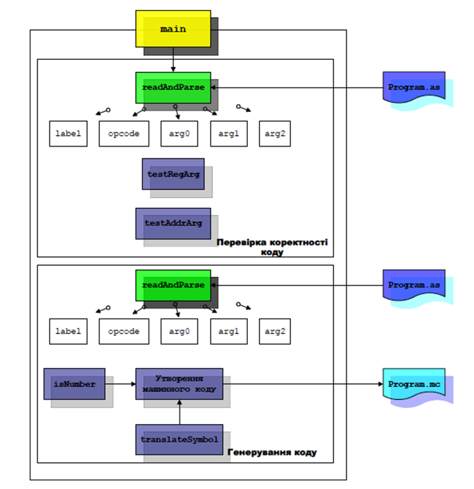
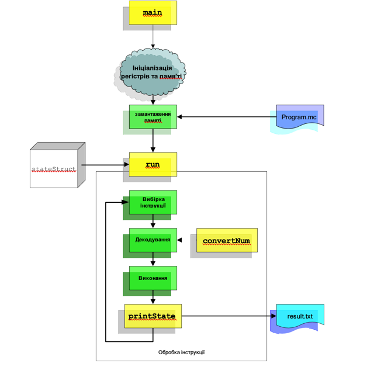

# Лабораторна Робота №3: Асемблер і симулятор комп’ютера LC-2K

## Мета

Опанувати роботу асемблера на симуляторі машини Ноймана, зрозуміти і дослідити принцип виконання програми машиною Ноймана.

## Завдання

скласти програму на асемблері, перетворити її у машинні коди, запустити симулятор, увести до нього коди машинних інструкцій, проаналізувати і пояснити отримані результати, скласти звіт з виконання лабораторних досліджень та захистити його.
## Теоретичні відомості

Розглядається симулятор та асемблер 32-розрядного CISC-комп’ютера. Він містить:
- 8 регістрів (регістр 0 завжди зберігає 0)
- 65536 комірок пам’яті по 32 біти
- один спосіб адресації - прямий регістровий («база-регістр + 16-бітове зміщення»)

Набір машинних інструкцій включає 8 команд (таблиця 3.1).:

### Таблиця 3.1. Множина інструкцій

#### Інструкції R-типу

| № | Інструкція | Код | Сутність інструкції |
|--:|------------|-----|---------------------|
| 1 | `add`      | 000 | Додає вміст регістру regA до вмісту regB, та зберігає в destReg |
| 2 | `nand`     | 001 | Виконує логічне побітове І-НЕ вмісту regA з вмістом regB, та зберігає в destReg |

#### Інструкції I-типу

| № | Інструкція | Код | Сутність інструкції |
|--:|------------|-----|---------------------|
| 3 | `lw`       | 010 | Завантажує regB з пам’яті. Адреса пам’яті формується додаванням зміщення до вмісту regA. |
| 4 | `sw`       | 011 | Зберігає вміст регістру regB в пам’ять. Адреса пам’яті формується додаванням зміщення до вмісту regA. |
| 5 | `beq`      | 100 | Якщо вміст регістрів regA та regB однаковий, виконується перехід на адресу PC + 1 + зміщення. В ПЛ зберігається адреса поточної (тобто beq) інструкції. |

#### Інструкції J-типу

| № | Інструкція | Код | Сутність інструкції |
|--:|------------|-----|---------------------|
| 6 | `jalr`     | 101 | Спочатку зберігає ПЛ+1 в regB, де ПЛ — адреса поточної (jalr) інструкції. Потім виконує перехід на адресу, яка зберігається в regA. Якщо regA і regB однакові — спочатку в цей регістр запишеться ПЛ+1, а потім виконається перехід до ПЛ+1. |

#### Інструкції O-типу

| № | Інструкція | Код | Сутність інструкції |
|--:|------------|-----|---------------------|
| 7 | `halt`     | 110 | Збільшує значення ПЛ на 1, потім припиняє виконання. Симулятор повідомляє про зупинку. |
| 8 | `noop`     | 111 | Нічого не виконується. |


### Формат лінійки асемблерного коду

Кожен рядок асемблерного коду має наступну структуру:

```
<мітка> <інструкція> <поле1> <поле2> <поле3> ; коментар
```

- **Мітка** (опціонально):  
  Розміщується на крайньому лівому полі.  
  Може містити максимум **6 символів** — **букви або цифри**, але **обов’язково починатися з літери**.  
  Навіть якщо мітка відсутня, **пробіл після неї (тобто перед інструкцією) є обов’язковим**.

- **Інструкція**:  
  Обов’язкове поле. Має бути однією з інструкцій, наведених у таблиці 3.1.

- **Операнди (поля 1–3)**:  
  Залежно від типу інструкції, кількість полів і значення можуть відрізнятись:
  
  - **R-тип (add, nand)**:  
    Потребують **3 поля**:  
    - поле№1 – `regA`  
    - поле№2 – `regB`  
    - поле№3 – `destReg`

  - **I-тип (lw, sw, beq)**:  
    Також потребують **3 поля**:  
    - поле№1 – `regA`  
    - поле№2 – `regB`  
    - поле№3 – зміщення (**десяткове число** або **символьна адреса**).  
    Значення може бути **додатнім або від’ємним**.

  - **J-тип (jalr)**:  
    Потребує **2 поля**:  
    - поле№1 – `regA`  
    - поле№2 – `regB`

  - **O-тип (halt, noop)**:  
    **Не потребує жодного поля**.

- **Символьні адреси**:  
  Використовуються замість числових зміщень.  
  - Для `lw` та `sw` асемблер обчислює **зміщення = адреса мітки**.  
    Можна використовувати `regA = 0` для прямого доступу, або інший регістр як базу масиву.  
  - Для `beq` асемблер обчислює **зміщення = мітка - (адреса поточної інструкції + 1)**.

- **Коментар**:  
  Починається після останнього поля через пробіл починаючи з символа "#", триває до кінця рядка.

---

### Директива `.fill`

Крім інструкцій, програма може містити директиву **`.fill`**, яка:

- Зберігає **число або адресу мітки** у відповідну комірку пам’яті.
- Має формат:

```asm
.fill <значення або мітка>
```

- **Приклади**:
  - `.fill 32` — зберігає **число 32**.
  - `.fill start` — зберігає **адресу мітки `start`** (наприклад, 2, якщо вона знаходиться на третій стрічці).

> 📌 Примітка: кожен рядок програми має свою адресу, починаючи з 0. Отже, `.fill` зберігає дані **за адресою свого рядка**.


## Схема роботи асемблера

Загальна схема роботи асемблера (рис. 1) складається з 2 проходів. На першому проході асемблер перевіряє коректність синтаксису команд. На другому виконується генерування відповідних машинних команд, тобто числового представлення асемблерної команди.

Функція `readAndParse` виконує зчитування рядку асемблерної програми і декодування на відповідні поля: мітка, код операції, операнди. Отримана таким чином і декодована інструкція перевіряється на коректність: існування команди, відповідна кількість аргументів, існування міток та т. п.

Функція `testRegArg` перевіряє коректність використання назви регістра.  
Функція `testAddrArg` перевіряє коректність використання адреси.  
Функція `labelArray` перетворює відповідну мітку у адресу.

Файли: `Program.as` – вхідний, `Program.mc` – вихідний.

#### Рис. 1. Схема роботи асемблера



Симулятор починає свою роботу з ініціалізації пам’яті та регістрів значенням 0 (рис. 2). Далі відбувається завантаження програми у машинних кодах в пам’ять, покрокове виконання інструкцій та вивід стану на зовнішній пристрій (екран або файл).

У `stateStruct` зберігається стан машини — значення регістрів, пам’яті та програмного лічильника.

- `run` — обробляє інструкції з пам’яті
- `printState` — виводить поточний стан машини
- `convertNum` — виконує перетворення числа у доповняльний код

#### Рис. 2. Функціональна схема симулятора




## Приклад асемблерної програми: Обчислення `Fibonacci(10)`

Файл: [`input.as`](input.as)

```asm
        # Fibonacci(10) -----------------------------------------------------
        lw   0 1 ten       # R1 ← 10     ← лічильник N
        lw   0 2 zero      # R2 ← 0      ← F(n-1)  (a)
        lw   0 3 one       # R3 ← 1      ← F(n)    (b)
        lw   0 4 neg1      # R4 ← −1     ← для декременту

loop    beq  1 0 done      # якщо N == 0 → результат уже в R2
        add  2 3 5         # R5 = R2 + R3   (F(n+1))
        add  3 0 2         # R2 = R3        (зсув a ← b)
        add  5 0 3         # R3 = R5        (зсув b ← c)
        add  1 4 1         # N  = N − 1
        beq  0 0 loop      # безумовний перехід

done    sw   0 2 result    # зберегти F(10)=55 у пам'ять
        halt               # завершити симуляцію

        # --- дані ---------------------------------------------------------
ten     .fill 10
zero    .fill 0
one     .fill 1
neg1    .fill -1
result  .fill 0            # тут з’явиться 55
```

Ця програма реалізує ітеративне обчислення 10-го числа Фібоначчі. Результат буде збережено у пам’яті за міткою `result`.

> 📄 Завантажити: [input.as](https://github.com/dmytro-kushnir/microprocessor-sim/blob/main/input.as)


### Запуск ассемблювання

```bash
python3 assemble.py  # input.as  →  output.mc
```


### Згенерований машинний код (`output.mc`)

```
8454156     # lw 0 1 ten       → завантажити 10 у R1
8519693     # lw 0 2 zero      → завантажити 0 у R2
8585230     # lw 0 3 one       → завантажити 1 у R3
8650767     # lw 0 4 neg1      → завантажити -1 у R4
17301509    # beq 1 0 done     → якщо R1 == 0 → перехід до done
1245189     # add 2 3 5        → R5 = R2 + R3
1572866     # add 3 0 2        → R2 = R3
2621443     # add 5 0 3        → R3 = R5
786433      # add 1 4 1        → R1 = R1 - 1
16842746    # beq 0 0 loop     → безумовний перехід до loop
12714000    # sw 0 2 result    → зберегти R2 у result
25165824    # halt             → завершити виконання

# --- Дані ---
10          # ten     .fill 10
0           # zero    .fill 0
1           # one     .fill 1
-1          # neg1    .fill -1
0           # result  .fill 0 (тут з’явиться результат — 55)
```

### Запуск симулятора

```bash
python3 simulate.py  # output.mc ->  result.txt
```

### Згенерований результат (`result.txt`)

```
- pc:11         # Лічильник команд зупинився на інструкції halt (адреса 11)
- r0:0          # Регістр 0 — завжди 0
- r1:0          # R1 — лічильник ітерацій, зменшений до 0
- r2:55         # R2 — результат F(10)
- r3:89         # R3 — F(11), обчислений на останньому кроці
- r4:4294967295 # R4 — значення -1 у 32-бітовому доповняльному коді
- r5:89         # R5 — тимчасове збереження F(n+1)
- r6:0          # Не використовувався
- r7:0          # Не використовувався

- machine halted                # Машина завершила виконання
- instructions executed: 66    # Виконано 66 інструкцій (10 обертів + ініціалізація + завершення)

- --- memory state ---         # Стан пам’яті:
- mem[0] = 8454156     # lw 0 1 ten       → завантаження 10 у R1
- mem[1] = 8519693     # lw 0 2 zero      → завантаження 0 у R2
- mem[2] = 8585230     # lw 0 3 one       → завантаження 1 у R3
- mem[3] = 8650767     # lw 0 4 neg1      → завантаження -1 у R4
- mem[4] = 17301509    # beq 1 0 done     → перевірка завершення
- mem[5] = 1245189     # add 2 3 5        → F(n+1)
- mem[6] = 1572866     # add 3 0 2        → зсув R3 → R2
- mem[7] = 2621443     # add 5 0 3        → зсув R5 → R3
- mem[8] = 786433      # add 1 4 1        → декремент лічильника
- mem[9] = 16842746    # beq 0 0 loop     → безумовний перехід
- mem[10] = 12714000   # sw 0 2 result    → запис результату
- mem[11] = 25165824   # halt             → завершення програми

- mem[12] = 10         # .fill 10 (мітка ten)
- mem[14] = 1          # .fill 1 (мітка one)
- mem[15] = 4294967295 # .fill -1 (мітка neg1, у двійковому представленні)
- mem[16] = 55         # .fill result (тут збережено F(10) = 55)
```

## 🔧 Завдання 1: Створення та запуск програми

1. Створіть файл з розширенням `.as` у будь-якому текстовому редакторі.
2. Напишіть асемблерну програму відповідно до вашого індивідуального варіанту.
3. Збережіть файл.
4. Скомпілюйте програму за допомогою скрипта `assemble.py`:
   ```bash
   python3 assemble.py input.as output.mc
   ```
5. Запустіть симулятор `simulate.py` з отриманим машинним кодом:
   ```bash
   python3 simulate.py output.mc
   ```
6. Проаналізуйте файл `result.txt`:
   - перевірте правильність логіки,
   - відстежте зміни у регістрах, пам’яті та програмному лічильнику.
7. Підготуйте звіт.

## 🧪 Завдання 2: Модифікація інструкцій

1. Ознайомтесь з кодом `assemble.py` та `simulate.py`.
2. Вивчіть реалізацію існуючих інструкцій.
3. Замініть або додайте інструкцію згідно з індивідуальним варіантом (наприклад, замість `noop`).
4. Перетворіть `.as` файл у машинний код:
   ```bash
   python3 assemble.py modified.as modified.mc
   ```
5. Запустіть симуляцію:
   ```bash
   python3 simulate.py modified.mc
   ```
6. Перевірте коректність виконання та змін.
7. Підготуйте звіт.
8. 
## 🧪 Завдання 3: Виконання арифметичного виразу та дослідження машинного коду

1. Виконайте арифметичний вираз згідно з індивідуальним варіантом.
2. Перетворіть `.as` файл у машинний код:
   ```bash
   python3 assemble.py modified.as modified.mc
   ```
3. Запустіть симуляцію:
   ```bash
   python3 simulate.py modified.mc
   ```
4. Перевірте коректність виконання та змін.
5. Проааналізувати отриманний машинний код.
6. Підготуйте звіт.

## 📝 Структура звіту

1. **Титульна сторінка** (номер роботи, ПІБ, назва дисципліни).
2. **Мета роботи**.
3. **Фрагменти зміненого коду** (інструкції, функції).
4. **Лістинг тестової програми**.
5. **Результати виконання**:
   - початковий і фінальний стан регістрів та пам’яті,
   - проміжні стани (тільки зі змінами),
   - загальна статистика (кількість інструкцій, `pc`, тощо).
6. **Висновки** — аналіз роботи, труднощі, чи досягнуто мети.